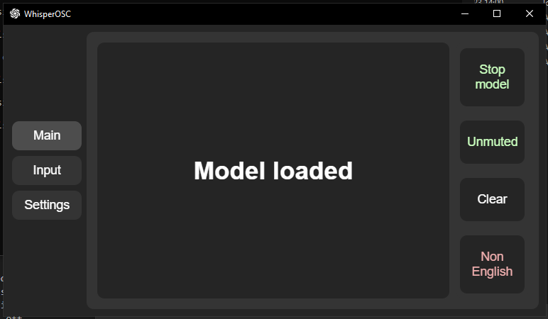

# WhisperOSC

This is a modified script from https://github.com/davabase/whisper_real_time to send the transcription to VRChat through OSC!

> This app requires you to have FFMpeg installed and added to your PATH
> ### This app requires Python 3.10 to be installed. Using pythong 3.11 will fail the installation
> This app requires you to have git installed to install the dependencies

> If you want to use GPU, you must have the CUDA toolkit installed, **version 11**. Get it [here](https://developer.nvidia.com/cuda-11-7-1-download-archive).

Before running the app, make sure to install the dependencies by running the INSTALLREQUIREMENTS.bat file

There's different AI models to use, the better they are the more accurate the transcription, but the more performance and **VRAM** required. It is important to remember that while the accuracy of the output is better the bigger the model is, it'll also take slightly longer to run, therefore increasing latency (Meaning more time passes between you speaking and the text appearing).
Play around with them to find what works best for you. I recommend base.

|  Size  | Parameters | Required VRAM |
|:------:|:----------:|:-------------:|
|  tiny  |    39 M    |     ~500 MB     |
|  base  |    74 M    |     ~500 MB     |
| small  |   244 M    |     ~1 GB     |

If you toggle Non English mode, it's a "language free" mode. This means that you can speak in whatever language you like, and it'll just work. You can switch language to language from one sentence to another. However, since the AI needs to identify the language it can get it wrong. If you're only going to speak english, stick to having it off.

To launch the app, simple run the WhisperOSC.exe file!

The first time using a model it will be downloaded. This process may take a bit, depending on your internet speed and model size. (Larger models take significantly longer to download).
This only has to be done once.
The models are downloaded to C:\Users\YourUser\.cache\huggingface\hub